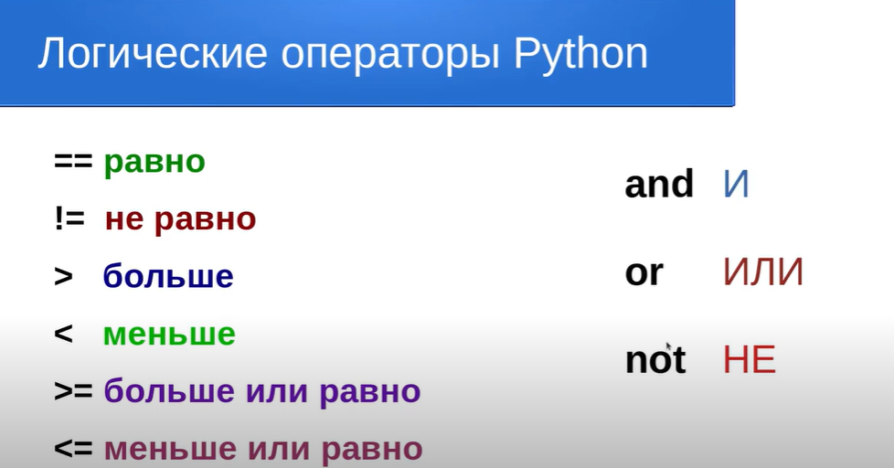

# Учебные задания по Python V3 (базовый уровень)

Выполните следующие задания. Решения для каждого задания пишите в отдельном файле в папке `tasks/`.

---

## Задание 1. Найти сумму разрядов числа
В файле `tasks/task1.py`

Дано целое положительное трехзначное число. Ваша задача — найти сумму разрядов этого числа.

```
Sample Input 1:

123
Sample Output 1:

6
Sample Input 2:

109
Sample Output 2:

10
```
---

## Задание 2.  Электронные часы - 1
В файле `tasks/task2.py` 
На электронных часах время отсчитывается в часах (0–23) и минутах (0–59). Вам дано число n — количество минут, прошедших с начала суток.

Напишите программу, которая определяет текущее время на часах, если с полуночи прошло n минут.

📌 Важно: если n превышает 1440 минут (сутки), учитывайте только минуты текущих суток.

**Формат входных данных**
Одно целое число n $0 \leq n \leq 10^6$

```
Sample Input 1:

137
Sample Output 1:

2 17
Sample Input 2:

2879
Sample Output 2:

23 59
Sample Input 3:

1511
Sample Output 3:

1 11
Sample Input 4:

608862
Sample Output 4:

19 42
```
---

## Задание 3. Выиграть в лотерею
В файле `tasks/task3.py` 
У Олега в банке есть n евро. Он хочет снять всю сумму наличными. Номиналы еврокупюр равны 1, 5, 10, 20, 100. Какое минимальное число купюр должен получить Олег после того, как снимет все деньги? На вход программе поступает одно положительные целое число n.
```
Sample Input 1:

125
Sample Output 1:

3
Sample Input 2:

43
Sample Output 2:

5
Sample Input 3:

10000000
Sample Output 3:

100000
```
---

## Задание 4. Следующее четное 
В файле `tasks/task4.py` 

Дано целое число n. Выведите следующее за ним четное число.

Задачу необходимо решить целочисленными операциями без использования условных операторов и\или циклов.

```
Sample Input 1:

5
Sample Output 1:

6
Sample Input 2:

6
Sample Output 2:

8
Sample Input 3:

401
Sample Output 3:

402
Sample Input 4:

163
Sample Output 4:

164
```
---
## Задание 5. Электронные часы - 2

В файле `tasks/task5.py` 

Электронные часы показывают время в формате h:mm:ss, то есть сначала записывается количество часов в диапазоне от 0 до 23, потом обязательно двузначное количество минут, затем обязательно двузначное количество секунд. Количество минут и секунд при необходимости дополняются до двузначного числа нулями.

Программа получает на вход число n - количество секунд, которое прошло с начала суток.

Выведите показания часов, соблюдая формат.

```
Sample Input 1:

3721
Sample Output 1:

1:02:01
Sample Input 2:

5000
Sample Output 2:

1:23:20
Sample Input 3:

55408
Sample Output 3:

15:23:28
Sample Input 4:

48147
Sample Output 4:

13:22:27
```
## Бонусная часть
В файле `tasks/task6.py` 
## Задание №1 Плоскоземельщики
Некоторые древние люди считали, что Земля плоская. Что-то вроде тарелки, которая то ли плавает в бескрайнем океане, то ли стоит на спинах огромных слонов, стоящих на панцире огромной черепахи. В общем, дело тёмное. Говорят, что и в наше время имеются адепты подобных теорий.

Давайте на секунду предположим, что Земля, действительно, имеет форму тарелки. При этом размер этой тарелки должен быть достаточно большим, чтобы вся поверхность шарообразной Земли умещалась на такой тарелке. Другими словами, надо подобрать такую тарелку, чтобы площадь поверхности шарообразной Земли (площадь сферы) равнялась площади тарелкоподобной Земли (площадь круга). 

Давайте посчитаем радиус такой "тарелки" и длительность перелёта с одного конца "тарелки" на другой.

**Входные данные:**
Целое число x -- радиус шарообразной планеты (в километрах)

**Выходные данные:**
Два целых числа, записанных через пробел.

Первое число -- радиус тарелкоподобной планеты (в километрах);
Второе число -- время перелёта между диаметрально противоположными точками тарелкоподобной планеты на самолёте ИЛ-96 (скорость 900 км/ч).



```
Sample Input:

6378
Sample Output:

12756 28
```
## Задание №2 Шифр данных
Компании необходимо передавать данные по телефону, но есть опасение, что телефоны могут прослушиваться. Все данные передаются в виде четырёхзначных целых чисел. Представители компании попросили вас написать программу для шифровки их данных, чтобы сделать их передачу более надёжной.
Ваша программа должна считывать четырёхзначное число и шифровать его следующим образом: "Заменить каждую цифру значением (эта цифра + 7)%10. Затем поменять местами первую цифру и третью, вторую цифру и четвёртую." Затем вывести зашифрованное целое число.

**Входные данные:**
Четырёзначное целое положительное число X.

**Выходные данные:**
Число X, зашифрованное по указанному выше алгоритму.
```
Sample Input:

2458
Sample Output:

2591
```
## Требования
1. Используйте только то, что мы изучили (переменные, ввод `input`, преобразование типов, арифметика, map).
2. Решения пишите в отдельных файлах в папке `tasks/`.
3. Проверка идёт автоматически через автотесты.

## Не забудь команды для git:
```
git clone -клонировать репозитарий
git status - проверить состояние файлов перед индексом и коммитом
git add <имя файла> - добавить файл в индекс
git commit -m"собщение" - добавить файлы и собщение в репозитарий
git push origin main- "запушить" отправить репозитарий на удаленный сервер (Github)
```